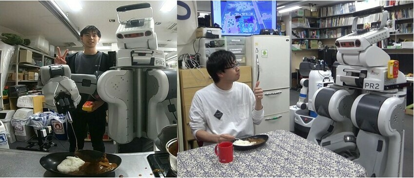

+++
title = "About Me"
description = "Hugo, the world's fastest framework for building websites"
date = "2023-09-07"
aliases = ["about-us", "about-hugo", "contact"]
author = "Naoaki Kanazawa"
+++

## Naoaki Kanazawa

I am a Ph.D. student in [JSK Robotics Laboratory](http://www.jsk.t.u-tokyo.ac.jp/ ) at The University of Tokyo.

I am researching intelligent robots that can perform tasks in the real world, in order to realize a future where robots work in various places such as homes, facilities, hotels, stores, and factories, and support human life and society.
Currently, I am focusing on life support robots, especially the recognition, action, planning, and learning of cooking support robots.

### Education
* JSPS Research Fellowship for Young Scientists DC2, 2024- (Japan Society for the Promotion of Science)
* Ph.D. in Mechano-Informatics, 2023- (Graduate School of Information Science and Technology, The University of Tokyo)
* M.S. in Mechano-Informatics, 2021-2023 (Graduate School of Information Science and Technology, The University of Tokyo)
* B.S. in Mechano-Informatics, 2017-2021 (Faculty of Engineering, The University of Tokyo)
