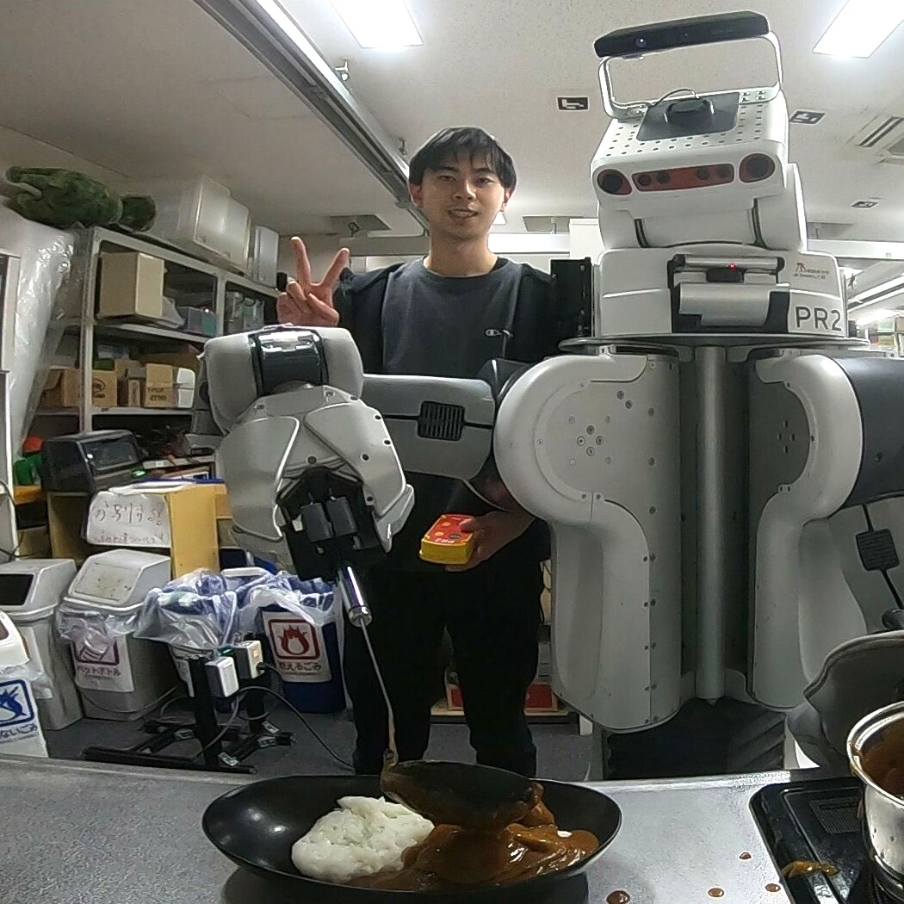

+++
title = "About Me"
description = "Hugo, the world's fastest framework for building websites"
date = "2023-09-07"
aliases = ["about-us", "about-hugo", "contact"]
author = "Naoaki Kanazawa"
+++

## Naoaki Kanazawa

I am a Ph.D. student in [JSK Robotics Laboratory](http://www.jsk.t.u-tokyo.ac.jp/ ) (Prof. Masayuki Inaba and Kei Okada) at The University of Tokyo. My research interests are mainly in cooking robots, life support robots, recognition , manipulation, and planning.

### Career
* Ph.D. in Mechano-Informatics, 2023- (Graduate School of Information Science and Technology, The University of Tokyo)
* M.S. in Mechano-Informatics, 2021-2023 (Graduate School of Information Science and Technology, The University of Tokyo)
* B.S. in Mechano-Informatics, 2017-2021 (Faculty of Engineering, The University of Tokyo)
